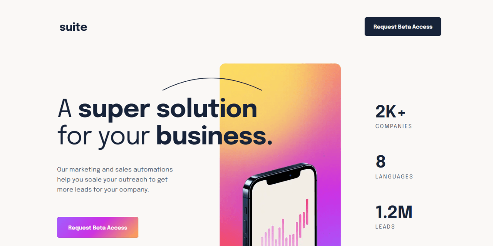

# 🚀 Suite landing page




Responsive landing page built with semantic HTML and modern CSS.  
Focus on clean structure, accessibility, and scalable styling architecture.

This is a solution to the [Suite landing page challenge on Frontend Mentor](https://www.frontendmentor.io/challenges/suite-landing-page-tj_eaU-Ra).

---

## 🔗 Links

- 🌎 [Live site](https://vimpdev.github.io/fem-junior-htmlcss-06-suite-landing-page/)
- 📌 [Frontend Mentor solution](https://www.frontendmentor.io/solutions/suite-landing-page-semantic-html-and-scalable-css-layer-7gCKe6ZXH_)

---

## 🎬 Demo


---

## 📸 Screenshots

| 📱 Mobile | 📲 Tablet |
| --- | --- |
|  |  |

| 🖥️ Desktop | 🖱️ Hover | ⌨️ Focus |
| --- | --- | --- |
|  |  |  |

---

## 🧠 What I focused on

- Writing **semantic and accessible HTML**
- Structuring CSS using **layers (`@layer`)**
- Building reusable layout patterns like:
  - `stack` (vertical spacing)
  - `cluster` (horizontal alignment)
- Using **custom properties (tokens)** for consistency
- Applying a **mobile-first workflow**

---

## 🛠 Built with

- Semantic HTML5
- CSS custom properties
- Flexbox & Grid
- CSS `@layer` architecture
- Mobile-first approach

---

## 💡 What I learned

### 1. Grouping content properly (semantics + layout)

I learned to group related elements instead of styling everything individually:

```html
<div class="testimonial__header stack">
  <h2>...</h2>
  <blockquote>...</blockquote>
</div>
```
This made spacing and structure much easier to manage.

### 2. Naming matters

I improved class naming to be more reusable:

- `highlight-text` → `text-emphasis`
- clearer separation between layout and meaning

---

## 🚧 Challenges I faced

- Structuring the testimonial section with grid + layered elements
- Managing spacing consistently across breakpoints

---

## 🤖 AI Collaboration

I used AI tools as a support tool during development, mainly for:

- Debugging CSS issues and understanding why certain styles didn’t apply
- Reviewing semantic HTML structure
- Getting suggestions to improve naming and code organization

It helped me validate decisions and learn faster, especially when working with layout patterns and CSS architecture.

---

## 👩‍💻 Author

- Frontend Mentor – [@vimpdev](https://www.frontendmentor.io/profile/vimpdev)

---